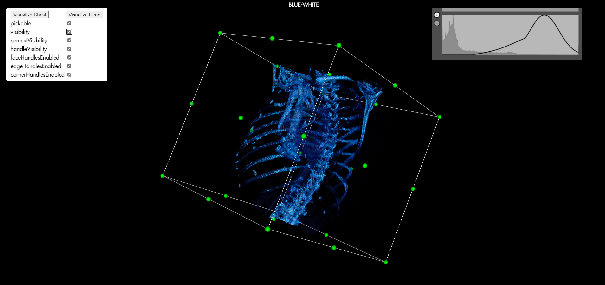
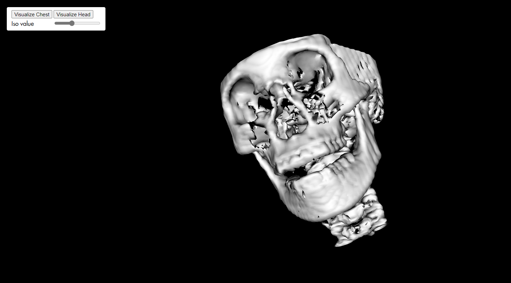

# Medical Visualization WebApp

This is a  Web GUI application that does 3D visualization of DICOM series Using VTK.js library.

## Website Link

### <a href= "https://mo-gaafar.github.io/Medical_Visualization_WebApp/dist/index.html">🔗 Click Here</a>

## Our Team

| Names             |
| ----------------- |
| Mohamed Nasser    |
| Ahmed Osama       |
| Mariam Hanafy     |
| Hassan Samy       |

## Features

### Ray Casting Volume Rendering and Volume Cropping

### Surface Rendering with adjustable ISO value

## Video Preview

## Issues we faced

1. Merging the examples together into one javascript file was challenging.
2. Connecting the button to the different functions in the script to act as tabs
3. BASE_PATH relative reference was not working so we had to replace it multiple times when using old examples
4. Merging the transfer function into the cropping tab.
5. Understanding the role of each object in the rendering pipeline. (actor, renderer, mapper, volume)

